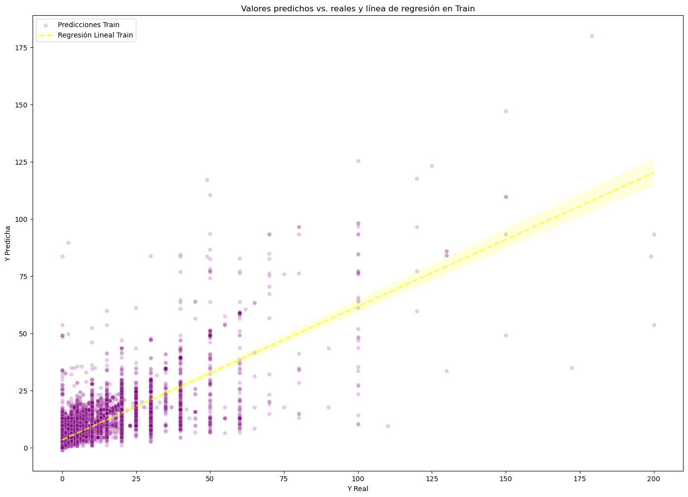

<p align=center><p>

# <h1 align=center> **PROYECTO INDIVIDUAL Nº1** </h1>

# <h1 align=center>**<span style="color:plum">Machine Learning Operations (MLOps)</span>**</h1>

<p align="center">
  
</p>

### Este primer proyecto individual nos hará recorrer el ciclo de Machine Learning Operations, partiendo de un dataset de juegos de la plataforma Steam, hasta llegar a un modelo de Machine Learning predictivo.
<br>
<div style="text-align: right; color: violet; font-size: 1.2em; font-weight: bold;">
  <a href="https://github.com/MarFloCaro" style="color: violet; text-decoration: none;">
    by Maria Florencia Caro, Cohorte 13
  </a>
</div>

# <h1 align=center> **Intro** </h1>

El desafío planteado en para este proyecto consiste en desarrollar un proceso de MLOs que incluya etapas de Ingeniería de Datos con su correspondiente Extraction, Transform and Load (ETL), pasando al Machine Learning, con Exploratory Data Analysis (EDA), junto con la exploración y entrenamiento de modelos; finalizando con el deployment tanto del modelo como de los datos del proceso ETL.

# <h1 align=center> **Desarrollo del Proyecto**</h1>

## ETL/Ingeniería de Datos

En el rol de Data Engineer, encaramos el proceso de ETL. El detalle del proceso puede ser encontrado en el archivo [etl.ipynb](/entregables/etl.ipynb), con comentarios en Markdown paso a paso, pero algunos de los pasos destacados son (en orden, aunque algunos pasos se repiten luego de su primera aparición):

+ Importación de librerías y lectura del archivo original.
+ Conversión a dataframe de pandas, ejecución de info() para una primera observación general.
+ Observación el formato de los datos en el dataset, a la vez se observa el diccionario de datos provisto.
+ Búsqueda y observación de filas sin datos útiles (vacíos, datos inespecíficos, duplicados)
+ Eliminación de columnas que no van a ser usadas en aplicaciones posteriores, tales como ID.
+ Conversión de los tipos de datos asignados por defecto a tipos adecuados
+ Exploración de columnas con similitudes y sustitución de datos ausentes usando las similitudes.
+ Eliminación de columnas redundantes (columnas que aportan datos casi idénticos).
+ Sustitución de valores string por valores float o NAN donde sea posible, y re-asignación de tipo de datos de la/s columnas que lo permitan.
+ Reemplazo de valores sin relación con la columna donde se encuentran por NA.
+ Reinicio el index y guardado del dataset como archivo de parquet (elegido por almacenar data types y su bajo peso de archivo comparado con alternativas .json y .csv) para posterior uso de la aplicación FAST API, para sus primeras 6 funciones.

## EDA

Nuevamente, el detalle de este proceso puede seguirse paso a paso en el Jupyter Notebook ([eda.ipynb](/entregables/eda.ipynb)). Algunos puntos a destacar son:

+ Partida desde el archivo parquet elaborado en la etapa ETL
+ Descarte de filas que no contienen precios (ya que precio será la variable a predecir por el modelo)
+ Primer observación matriz de correlación
+ Creación de una nueva columna para hacer observaciones de tiempo según la edad del release en meses y observación del comportamiento de la nueva columna respecto al precio
+ Scatter plot y observación de outliers, puntos a destacar
    * Si la edad del release es mayor a aproximadamente 180 meses (15 años), los precios de los juegos están concentrados por debajo de 25
    * Si la edad del release es menor, la dispersión de precios es notable. La mayoría aún se concentra entre 0 y 25, pero hay muchos puntos por encima de ese rango también
+ Columnas calculadas de cantidad de juegos por developer y el precio promedio por developer
+ Nueva matriz de correlación para ver la fuerza de la edad del release, y precios promedio.
+ Exploración y decisión sobre columnas numéricas existentes con baja correlación al precio.
+ Exploración de Géneros y Sentiments con técnica one hot encoding, decisión respecto a las mismas.
+ Eliminación de filas que carecen de valores en las columnas seleccionadas para explorar modelos.
+ Reinicio del index y guardado del dataframe en archivo parquet, para ser consumido por el modelo.

## Experimentación y Entrenamiento con Modelos

### 1. Exploración de Modelos
<hr>

***Modelos Explorados y Entrenados:***
* Modelo Regresión Lineal
* Modelo Regresión Lineal con características polinomiales
* Modelo de Árbol (Tree)
* Modelo K-Vecinos
* Modelo Random Forest
* Modelo Support Vector Regressor
    + Kernel lineal
    + Kernel polinomial
    + Kernel radial basis function
* Modelo de Ensamble: Stacking con 3 modelos de mejor performance

***Pasos***<br>
Detalle completo en [experimentacion_entrenamiento.ipynb](/entregables/experimentacion_entrenamiento.ipynb)
+ Usando como origen el archivo generado en la etapa EDA, definimos X e y, dividimos en sets de test y train, y escalamos los datos.
+ Por cada Modelo:
    + Pre procesamiento adicional en caso de ser necesario (poly features)
    + Instanciamos el modelo y ajustamos el set de entrenamiento.
    + Predecimos.
    + Observamos MSE, RMSE y R2.
    + Gráficos adecuados al modelo.
+ En los modelos con menos error
    + Observamos la validación cruzada
+ Curva de aprendizaje
    + Aplicación de técnicas de curva de aprendizaje para varios modelos que permiten hiperparámetros (algunos fueron muy exigentes en procesamiento y no fue posible)

### 2. Pruebas de predicciones individuales y procesamiento de input
<hr>

+ Simulamos input de usuario de nuestra función API de predicción.
+ Realizamos cálculos para campos calculados.
+ Formateamos y escalamos adecuadamente para cada modelo.
+ Predecimos para los modelos de mejor rendimiento/menor error.
+ Guardamos los pre procesamientos en un archivo de pickle para uso de la app.
+ Guardamos el RMSE del modelo lineal en testeo en un archivo.
+ Guardamos el modelo elegido en un archivo de pickle.
    + Todos los modelos con base lineal tuvieron performances similares, por encima de los modelos no basados en el lineal. Por simplicidad del modelo, y un menor peso de archivo, elegimos el modelo clásico lineal.
+ Probamos los archivos.
  
<p align="center">
  
</p>


## Desarrollo de la aplicación de FAST API

### La misma consta de 3 funciones de validación de datos, 1 ruta raíz, 6 rutas de consulta de datos del dataset (endpoints), más la ruta de predicción de precio de juegos usando el modelo de Machine Learning.

```Python
def validar_fecha(release_date):
    """ Valida que la fecha del query sea en formato YYYY-MM-DD """

def validar_entero(year):
    """ Valida que el año provisto sea entero """

def validar_anio(year):    
    """ Valida que el año provisto esté dentro del dataset """

@app.get('/')
def root():
    """ Mensaje de bienvenida """

@app.get('/genero/{year}')
def genero(year:str): 
    """ Se ingresa un año en números enteros y devuelve una json con los 5 géneros con más lanzamientos en ese año,
    en formato género: cantidad, en orden descendente por cantidad. En caso de no haber datos suficientes para al menos 1 género, retorna un mensaje de error.
    
    Ejemplo de retorno: {"Simulation":2,"Strategy":2,"Adventure":2,"Action":1,"Indie":1}
    """

@app.get('/juegos/{year}')
def juegos(year:str):
    """ Se ingresa un año en números enteros y devuelve un json con los juegos lanzados en el año, usando el año como key
    y una lista con los nombres de los juegos como valor. En caso de no haber datos suficientes, retorna un mensaje de error.
    
    Ejemplo de retorno: {"1981":["Gallagher: Two Real","The Mystery of the Uurnog","Gallagher: Mad As Hell"]}
    """

@app.get('/specs/{year}')
def specs(year:str):
    """ Se ingresa un año en numeros enteros y devuelve un json con los 5 specs con más lanzamientos en ese año,
    en formato spec: cantidad, en orden descendente por cantidad. En caso de no haber datos suficientes para al menos una spec, retorna un mensaje de error.
    
    Ejemplo de retorno: {"Single-player":45,"Multi-player":13,"Steam Cloud":10,"Steam Trading Cards":7,"Captions available":7}
    """

@app.get('/earlyaccess/{year}')
def earlyaccess(year:str):
    """ Se ingresa un año en números enteros y devuelve un json con la cantidad juegos con early access lanzados en el año,
    usando el año como key y la cantidad de juegos como valor. En caso de no haber datos suficientes, retorna un mensaje de error.
    
    Ejemplo de retorno: {"2015":224}
    """

@app.get('/sentiment/{year}')
def sentiment(year:str): 
    """ Se ingresa un año en numeros enteros y devuelve un json con la categroría de sentiment y la cantidad de registros para ese año,
    en formato sentiment: cantidad. En caso de no haber datos suficientes para al menos un sentiment, retorna un mensaje de error.
    
    Ejemplo de retorno: {"Mixed": 182,"Very Positive": 120,"Positive": 278}
    """  

@app.get('/metascore/{year}')    
def metascore(year:str):
    """ Se ingresa un año en numeros enteros y devuelve un json con los 5 juegos con mayor metascore en ese año,
    en formato juego: metascore, en orden descendente por cantidad. En caso de no haber datos suficientes para al menos un metascore, retorna un mensaje de error.
    
    Ejemplo de retorno: {"BioShock Infinite":94.0,"Deus Ex: Human Revolution - Director's Cut":91.0,"FEZ":91.0,"Brothers - A Tale of Two Sons":90.0,"Spelunky":90.0}
    """

@app.get('/prediccion')
def prediccion(
    release_date: str = Query(),
    developer: str =  Query(),
    genre: str = Query()):
    """ Se ingresa fecha de lanzamiento (release_date) en formato YYYY-MM-DD, el estudio desarrollador (developer) y el/los género(s) (genre) del juego como cadenas de texto
    de la misma manera que aparecen en Steam. Para el género ingresamos valores separados por comas. Retorna el precio predicho para el juego y el RMSE (Root Mean Squared Error)
    del modelo de Machine Learning usado, o un mensaje de error en caso que el input sea incorrecto.

    Ejemplo de retorno: {"prediccion_precio": 21.41, "RMSE_Modelo_Regresion_Lineal": 6.43}
    """
```

# <h1 align=center> **Entregables**</h1>

## Aplicación de FAST API - SteamFastApi

La aplicación se encuentra disponible en [la siguiente ubicación](https://steamfastapi.onrender.com/). Tener en cuenta que Render apaga las aplicaciones, dar tiempo a que construya el contenedor y reinicie la app.

## Video

El video demostrando el funcionamiento de la aplicación se encuentra en [este link]()

## Índice de Archivos del Repo

### Carpeta Entregables
+ [ETL Jupyter Notebook](/entregables/etl.ipynb)
+ [EDA Jupyter Notebook](/entregables/eda.ipynb)
+ [Experimentacion y Entrenamiento Jupyter Notebook](entregables/experimentacion_entrenamiento.ipynb)

### Raíz del Repo (archivos de la app)
+ [Archivo Main de la app FAST API](main.py)
+ [Archivo Pickle con el pre procesamiento del Modelo](preprocessing_steps.pkl)
+ [Requerimientos de la app FAST API](requirements.txt)
+ [Valor del RMSE del modelo elegido](rmse_model.txt)
+ [Dataset para las funciones de consulta de la app FAST API](steam_data_clean.parquet)
+ [Dataset para el modelo de predicción de la app FAST API](steam_data_model.parquet)
+ [Archivo Pickle con el modelo de Machine Learning](trained_model.pkl)

## Fuentes de datos

### El repositorio no contiene los datos originales provistos para el proyecto, los mismos pueden ser encontrados en las siguientes ubicaciones:

+ [Dataset](https://drive.google.com/drive/folders/1HqBG2-sUkz_R3h1dZU5F2uAzpRn7BSpj?usp=drive_link): Carpeta con el archivo de origen en formato .json (steam_games.json).
+ [Diccionario de datos](https://docs.google.com/spreadsheets/d/1-t9HLzLHIGXvliq56UE_gMaWBVTPfrlTf2D9uAtLGrk/edit?usp=drive_link): Diccionario con algunas descripciones de las columnas disponibles en el dataset.
<br/>
